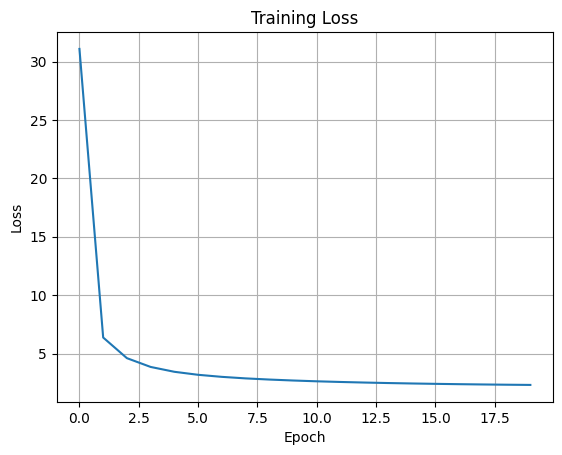

# GPT2-From Scratch: Tiny Tales Transformer — Children's Story Generator

A transformer-based language model trained from scratch to generate simple, heartfelt children’s stories
from short prompts. Inspired by the charm of storytelling and powered by the magic of deep learning!

A pretrained model trained for **20 epochs** is included in this repo as **`tinystories_gpt2_model.pth`** inside the
`LLM-gpt2-from-scratch-tinystories/` folder. Use it to quickly test text generation without retraining from scratch.

---

## Motivation

Language models are usually trained on complex corpora with adult-level vocabulary and themes. This project aims to explore
how a compact Transformer model, trained from scratch on a curated dataset of children’s stories, can learn to generate
coherent, imaginative, and age-appropriate text. The ultimate goal: a neural storyteller that can assist children, educators,
and parents in creating endless tales on demand.

---

##  Highlights

- **Trained from Scratch**: Built and trained on a custom dataset of children's stories using a Transformer architecture.
- **Tiny but Mighty**: Despite just 20 epochs of training, the model generates grammatically coherent, emotionally resonant stories.
- **Natural Dialogue**: Capable of maintaining believable conversations between characters.
- **Style-Aware**: Learns and mimics the gentle, optimistic tone typical of children's literature.

---

##  Project Structure

```bash

    LLM-gpt2-from-scratch-tinystories/
        │
        ├── model.py                    # VAE model definitions
        ├── utils.py                    # Training, loss, plotting functions
        ├── dataloader_generator.py     # Datat preprocessing and dataloader generating
        ├── demo_script.py              # Main training script
        ├── demo.ipynb                  # Jupyter notebook version
        ├── requirements.txt            # Dependencies
        ├── README.md                   # This file
        
```
---


## Getting Started

### Requirements

```bash
 Install dependencies with:

    pip install -r requirements.txt
    
```
 ### Running the Demo:
 ```bash
     python demo_script.py
     jupyter notebook demo.ipynb
     
```
---

## Training Summary

### Loss & Gradient Norm over Epochs

    | Epoch | Loss  | Grad Norm | Time (min) |
    |-------|-------|-----------|------------|
    | 1     | 31.08 | 46.18     | 17.67      |
    | 6     | 3.18  | 16.72     | 88.15      |
    | 11    | 2.63  | 12.24     | 88.07      |
    | 16    | 2.41  | 12.23     | 88.00      |
    | 20    | 2.32  | 11.16     | 70.42      |

---

### Text Generation Results by Method


Note: in the chart below [prompt] is used as a place holder for the entire prompt sentence given below

Prompt: It was a dark and stormy night, and the wind howled through the trees...


| Method                   | Sample Output (Truncated)                                                                                                                                                                                                                                              |
| ------------------------ | ---------------------------------------------------------------------------------------------------------------------------------------------------------------------------------------------------------------------------------------------------------------------- |
| **Beam Search**          | It was a dark and stormy night, and the wind howled through the trees and the birds were singing and dancing in the sky. One day, a little boy named Tim went to the park with his mom. At the park, Tim saw a big tree... A big wind came and blew the ball far away. |
| **Greedy Decoding**      | [prompt] and the trees. One day, a little girl named Lily. Lily saw a big tree... Then, a big wind came and blew the ball far away into the woods.                                                        |
| **Multinomial Sampling** | [prompt], hills, and even a-looking igloo... One day, a bird came to the farm... Inside the tunnel, he found a big vacation.                                                                              |
| **Temperature Sampling** | [prompt] and the grass... Sue said, “I want to marry you...”. The cat and mouse became friends. They cleaned their room and made them happy.                                                              |
| **Top-k Sampling**       | It was a dark and stormy night, and the wind howled through the trees and the grass. One day, he saw a red ball in the grass... The next day, Tim went back to the park with his mom... Tim saw a big tree and wanted to climb.                                        |

---



---


## Conclusion

This project demonstrates the effectiveness of training compact GPT-2 model designed from scratch on simplified children's literature (TinyStories)
to produce coherent, imaginative, and emotionally expressive short stories. Across decoding strategies—from deterministic greedy
and beam search to more diverse sampling methods—the model learns to generate whimsical narratives that align with the storytelling
structure and tone of the dataset.

With a training loss reduction from 31.07 → 2.31 and improvements in gradient stability over 20 epochs, the model converges well
on the task. The sample generations show how different decoding techniques shape the creativity and consistency of output—from
repetitive but grounded outputs with greedy decoding to quirky and unpredictable turns via temperature and multinomial sampling.

For rapid experimentation or storytelling demos, a fully trained model checkpoint is available in tinystories_gpt2_model.pth.

Whether you're building educational tools, experimenting with story generation, or simply exploring small-scale language modeling, this project offers a reproducible, lightweight foundation for fine-tuning GPT-style models on custom narrative data.

---
