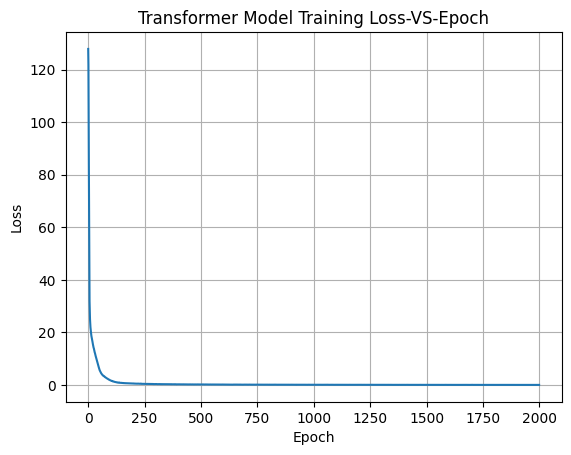

# Transformer-based Neural Machine Translation (English to Spanish)

This repository contains an end-to-end implementation of a Transformer model built from scratch in PyTorch to
translate English sentences into Spanish. Inspired by the "Attention is All You Need" paper, this project showcases
key components of the Transformer architecture, including self-attention, positional encoding, multi-head attention,
and feed-forward layers — all implemented manually.

---

## Features

- Pure PyTorch implementation — no Hugging Face or external model dependencies
- Encoder-Decoder architecture with multi-head attention
- Positional encodings to preserve token order
- Tokenization, padding, and language vocabulary building
- Gradient clipping and learning rate scheduling
- Trained on English-Spanish sentence pairs (Tatoeba dataset)

---

### Hyperparameters

| Parameter         | Value     |
|-------------------|-----------|
| embed_size        | 256       |
| num_layers        | 2         |
| num_heads         | 4         |
| ffn_hidden_dim    | 4*256     |
| Batch Size        | 32        |
| Learning Rate     | 1e-3      |
| Epochs            | 2000      |

. Optimizer: Adam
. Loss: CrossEntropyLoss (ignores padding tokens)
. Scheduler: Linear warmup with decay
. Gradient clipping: Enabled with max_norm=1.0

---


##  Project Structure

```bash
from-scratch-transformer-nmt/
    ├── model.py                    # Transformer model definition
    ├── dataloader_generator.py     # Tokenization, preprocessing, dataset & dataloader
    ├── utils.py                    # Training loop, evaluation
    ├── demo_script.py              # Train the model, visualize results, sample predictions (script format)
    ├── demo.ipynb                  # Interactive Colab/Notebook version of the demo
    ├── requirements.txt            # Required Python packages
    ├── README.md                   # Project overview, usage, results, etc.

```
---


## Getting Started

### Requirements

```bash
 Install dependencies with:

    pip install -r requirements.txt
    
```
 ### Running the Demo:
 ```bash
     python demo_script.py
     jupyter notebook demo.ipynb
     
```
---

## Training Summary

Training was run over 2000 epochs. The model was able to converge steadily from a noisy start to a more
structured language model. Below we show a few samples for correct and wrong translations made by the model. 

### Correct Translations

```bash

| **Input**                           | **Target**                                    | **Predicted**                                  |
|-------------------------------------|-----------------------------------------------|------------------------------------------------|
| is it ok if i turn the tv down ?    | ¿le importa si bajo el volumen del televisor ?| ¿le importa si bajo el volumen del televisor ? |
| i didn t need to do that did i ?    | no hacia falta que lo hiciera ¿verdad ?       | no hacia falta que lo hiciera ¿verdad ?        |
| can you show me how to tie a tie ?  | ¿puedes mostrarme como atar una corbata ?     | ¿puedes mostrarme como atar una corbata ?      |
| what a cute baby ! may i hold her ? | que preciosa bebe ! ¿puedo sujetarla ?        | que preciosa bebe ! ¿puedo sujetarla ?         |
| i m sure that i ll miss her a lot   | estoy seguro de que la voy a extranar mucho   | estoy seguro de que la voy a extranar mucho    |

```
---
### Incorrect Translations

```bash

| **Input**                           | **Target**                               | **Predicted**                           |
|-------------------------------------|------------------------------------------|-----------------------------------------|
| don t you want to give me a hug ?   | ¿no queres darme un abrazo ?             | ¿por que no queres usar una corbata ?   |
| so what is it you want me to do ?   | asi que ¿que es lo que quieres que haga ?| ¿que quieres que ¿que es lo que ¿que es |
| do you plan to go to tokyo by bus ? | ¿piensas ir a tokio en autobus ?         | ¿piensas ir a la radio ?                |
| you know why i m here don t you ?   | sabes por que estoy aqui ¿no ?           | sabes por que no veo la television      |
| do you want me to get rid of this ? | ¿quieres que me deshaga de esto ?        | ¿quieres que consigas ir a la cama ?    |


```
---
###  Loss & Gradient Norm Trend



---

## Conclusion

This project demonstrates that it's possible to build a functional English-to-Spanish translation system using the
Transformer architecture from scratch in PyTorch. While modern pre-trained models can achieve high performance with
fewer resources, implementing a translation model manually provides valuable insight into the mechanics of self-attention,
positional encoding, and sequence-to-sequence learning.


Although the current implementation shows promise on subsets of the data, scaling to larger corpora highlights the trade-offs
between model capacity, training time, and computational resources. With further tuning, improvements in decoding strategies
(like beam search), and optimizations such as checkpointing and evaluation metrics (e.g., BLEU), this project can evolve into
a more robust baseline for low-resource neural machine translation (NMT) systems.

Whether you're a researcher exploring transformer internals or an engineer seeking a practical translation model, this
repository offers a strong foundation for experimentation and learning.
---
