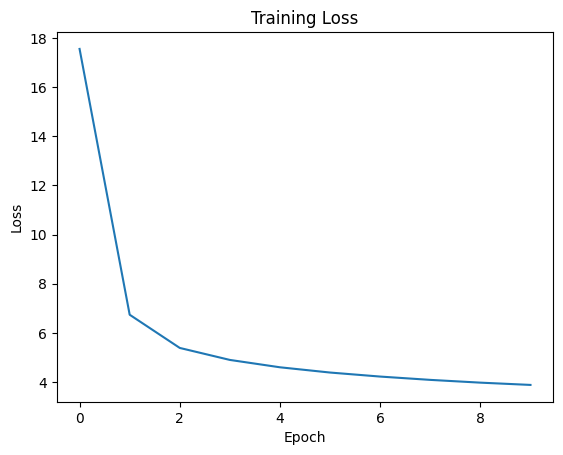

# TinyStories GPT — A Transformer Built From Scratch

This project is a **from-scratch implementation** of a GPT-style transformer model trained on the
[TinyStories dataset](https://huggingface.co/datasets/eminorhan/tinystories).
It does **not use any high-level training or model APIs** like Hugging Face’s `AutoModel`, `Trainer`,
or pre-built transformer blocks.

Instead, every component — including:

- Transformer layers (multi-head attention, feedforward, residuals)
- GPT decoder architecture
- Custom training loop
- Data loading and token shifting logic
- Inference with multiple decoding strategies

was **built manually using only PyTorch primitives**.

---

## Objective

Train a compact GPT-style model on a corpus of simple, self-contained children’s stories to generate short, coherent
narratives from a prompt.

---

## Model & Training Overview

- Framework: **PyTorch (low-level API only)**
- Model: **Decoder-only Transformer (GPT-like)**
- Dataset: [`TinyStories`](https://huggingface.co/datasets/eminorhan/tinystories)
- Tokenizer: `GPT2TokenizerFast` from Hugging Face (for simplicity)
- Training loop: **custom gradient updates, clipping, loss masking**
- Inference: **greedy, multinomial, temperature, top-k sampling**


### Hyperparameters

| Parameter         | Value     |
|------------------|-----------|
| Embedding Size    | 128       |
| Layers            | 2         |
| Attention Heads   | 4         |
| Context Length    | 256       |
| Batch Size        | 32        |
| Learning Rate     | 1e-4      |
| Epochs            | 10        |

---


##  Project Structure

```bash
transformer-from-scratch-GoEmotions-dataset/
    ├── model.py                    # Transformer decoder model definition
    ├── dataloader_generator.py     # Tokenization, preprocessing, dataset & dataloader
    ├── utils.py                    # Training, evaluation
    ├── demo_script.py              # Train the model, visualize results, sample predictions (script format)
    ├── demo.ipynb                  # Interactive Colab/Notebook version of the demo
    ├── requirements.txt            # Required Python packages
    ├── README.md                   # Project overview, usage, results, etc.

```
---


## Getting Started

### Requirements

```bash
 Install dependencies with:

    pip install -r requirements.txt
    
```
 ### Running the Demo:
 ```bash
     python demo_script.py
     jupyter notebook demo.ipynb
     
```
---

## Training Summary

Training was run over 10 epochs. The model was able to converge steadily from a noisy start to a more
structured language model.

### Epoch Checkpoints

| Epoch | Loss    | Grad Norm | Time (min) |
|-------|---------|-----------|------------|
| 1     | 17.5567 | 6.9271    | 2.72       |
| 6     | 4.3839  | 5.1507    | 13.63      |
| 10    | 3.8801  | 3.3120    | 10.88      |

#### Sample during Training

Prompt: **"how are you?"**

| Epoch | Output                                |
|-------|---------------------------------------|
| 1     | `how are you? the room. there there.` |
| 6     | `how are you? Tim. The bird was a`    |
| 10    | `how are you?’�. One`                 |

###  Loss & Gradient Norm Trend



---

## Text Generation Results

After training, the model was tested on the prompt:

> **"Once upon a time"**

Generated continuations are shown below using different decoding strategies:

---

### Greedy Decoding

> Once upon a time. He wanted to see the tree. The dog was happy.  
> One day, a little boy named Tim went to the park. Tim was very happy.  
> The little girl had a big, the bird. He wanted to play with his mom.  
> One day, the tree and the park. He saw a big tree and the tree.  
> The bird was very happy and said, "Let's mom and the bird, "I am the dog. I am the big, I will help you."  
> The little bird said, "I can I think the tree and you want to help me?" The bird. He said,

---

### Multinomial Sampling

> Once upon a time and shook the tree made the tree."  
> iskers else ran to his town, the clothes. He thought, and used his boy wenter and came to the home.  
> He saw a big swing covered the sheet on his noisy and yarn Lily are Sam were friend...  
> What, so bad and pulled... shoes and smiled... big lion... hockey... Tim said, "LookIt's big his toy!"

---

### Temperature Sampling (T=0.8)

> Once upon a time but his friend. Her mom said, "I am pretty girl, but she said was, "Let's big end.  
> He, Tom and broke jumped to the park. Hemy said, "Hey, please."  
> They blew And they went in the big bird to see the cat and.  
> The sun was… more and took a say. He felt better.  
> She grabbed, and reached the slide and laugh...

---

### Top-K Sampling (k=50, T=0.7)

> Once upon a time, the rabbit. She had a big tree.  
> He asked her head and her mom said, "Thank you want to see..."  
> "I can help me?" Tom heard a big red and said, "I want to play with the cat."  
> The cat was very happy. It said...

---


## Conclusion

This project demonstrates that even small transformer models trained on simple datasets can produce surprisingly coherent
and stylistically appropriate generations, especially when decoding strategies like top-k or temperature sampling are used.

Further improvements can include:
- Increasing model size (layers, heads, embedding)
- Fine-tuning decoding strategies
- Using better data augmentation or cleaning

---
