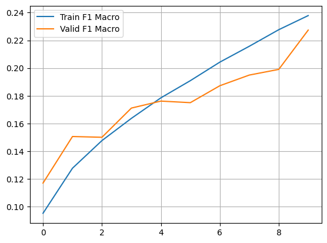

# Transformer-based Emotion Classification from Scratch

This repository implements a **Transformer Encoder** model built entirely from scratch in PyTorch for
multi-label emotion classification on the [GoEmotions dataset]
(https://github.com/google-research/google-research/tree/master/goemotions).

---

## Highlights

- Transformer Encoder architecture implemented from scratch (no pretrained transformers).
- Trained on GoEmotions dataset with 28 fine-grained emotion labels.
- Handles multi-label classification with class imbalance using weighted BCE loss.
- Utilities for training, evaluation, inference on raw text, and visualization.
- Steady improvements in macro F1 score over 10 epochs.
- Demonstrates meaningful emotion predictions on raw and test dataset samples.

---

## Model Architecture

The core components include:

- **Embedding Layer:** Token embeddings combined with sinusoidal positional encodings.
- **Multi-Head Attention:** Scaled dot-product attention split into multiple heads.
- **Feed-Forward Network:** Two-layer MLP with ReLU activation.
- **Encoder Layer:** Multi-head attention + feed-forward network with residual connections and layer normalization.
- **Stacked Encoder Blocks:** Multiple encoder layers stacked for better representation learning.
- **Output Layer:** Linear + Sigmoid for binary sentiment classification.

---


##  Project Structure

```bash
transformer-from-scratch-GoEmotions-dataset/
    ├── model.py                    # Transformer encoder model definition
    ├── dataloader_generator.py     # Tokenization, preprocessing, dataset & dataloader
    ├── utils.py                    # Training, evaluation, plotting, prediction utils
    ├── demo_script.py              # Train the model, visualize results, sample predictions (script format)
    ├── demo.ipynb                  # Interactive Colab/Notebook version of the demo
    ├── requirements.txt            # Required Python packages
    ├── README.md                   # Project overview, usage, results, etc.

```
---


## Getting Started

### Requirements

```bash
 Install dependencies with:

    pip install -r requirements.txt
    
```
 ### Running the Demo:
 ```bash
     python demo_script.py
     jupyter notebook demo.ipynb
     
```
---

## Training Results

The model was trained for 10 epochs . Training and validation F1 macro and losses are shown below:

| Epoch | Train Loss | Valid Loss | Grad Norm | Train F1 Macro | Valid F1 Macro |
|-------|------------|------------|-----------|----------------|----------------|
| 1     | 1.3806     | 1.2915     | 1.32      | 0.0952         | 0.1170         |
| 2     | 1.2380     | 1.2188     | 3.49      | 0.1277         | 0.1506         |
| 3     | 1.1382     | 1.1601     | 3.61      | 0.1477         | 0.1501         |
| 4     | 1.0538     | 1.1301     | 5.28      | 0.1637         | 0.1711         |
| 5     | 0.9794     | 1.1141     | 2.71      | 0.1785         | 0.1762         |
| 6     | 0.9221     | 1.1098     | 13.26     | 0.1909         | 0.1750         |
| 7     | 0.8637     | 1.1229     | 2.48      | 0.2043         | 0.1872         |
| 8     | 0.8198     | 1.1427     | 7.51      | 0.2157         | 0.1949         |
| 9     | 0.7812     | 1.1594     | 16.53     | 0.2277         | 0.1990         |
| 10    | 0.7446     | 1.2642     | 14.23     | 0.2379         | 0.2274         |

---

### Training Accuracy and Loss Curves



---

## Example Predictions on Sample Texts

| Input Text                                    | Predicted Emotions                            |
|-----------------------------------------------|-----------------------------------------------|
| I am so happy and excited about this!         | excitement, joy, love, pride, relief          |
| This makes me really angry and sad.           | anger, nervousness, sadness                   |
| I'm feeling a bit anxious but hopeful.        | nervousness, realization, relief, remorse     |
| I'm feeling very sad but also relieved.       | joy, remorse, sadness                         |

---

## Selected Test Set Samples and Model Predictions
```bash

| Input Text                                                    | True Emotions              | Predicted Emotions                                        |
|---------------------------------------------------------------|----------------------------|-----------------------------------------------------------|
| thanks harvard                                                | admiration                 | admiration, gratitude, love                                |
----------------------------------------------------------------|----------------------------|------------------------------
| so the article is pretty much nonsense                        | admiration, amusement      | admiration, approval, disgust, joy, relief                 |
----------------------------------------------------------------|----------------------------|------------------------------
| would love to donate as well                                  | admiration                 | admiration, approval, desire, excitement, joy, love, optimism |
----------------------------------------------------------------|----------------------------|------------------------------
| it was a painful cringe too are we <unk>                      | admiration                 | disappointment, fear, nervousness, realization, remorse, sadness, surprise, neutral |
----------------------------------------------------------------|----------------------------|------------------------------
| i agree his parents were very supportive then when            |                            |
|they did a cast change they decided to make his parents jerks  | admiration                 | approval, confusion, realization, neutral                 |
----------------------------------------------------------------|----------------------------|------------------------------
```
---

## Conclusion

This project presents a **Transformer Encoder built completely from scratch** to solve multi-label emotion classification,
handling class imbalance and raw text tokenization. Despite training without transfer learning or pre-trained embeddings,
the model achieves steady improvements in F1 score and produces interpretable multi-emotion predictions on both example texts
and real test samples.

This work serves as a solid foundation for exploring emotion detection and multi-label classification with custom architectures
in PyTorch.

---
