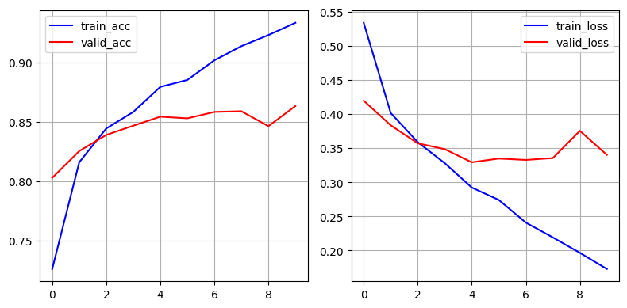
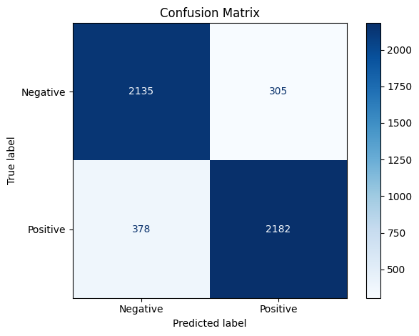

# Transformer-Based Sentiment Analysis from Scratch

This repository implements a **Transformer encoder-based sentiment analysis model built entirely from scratch
using PyTorch** — no huggingface transformers or pretrained models. It supports **variable-length inputs with
padding masking**, **causal masking**, and includes multi-head self-attention, positional encoding, and feed-forward
layers.

---

## Features

- Custom implementation of Transformer encoder blocks with multi-head attention.
- Supports masking to handle padded tokens in variable-length sequences.
- Trainable embedding layer with sinusoidal positional encoding.
- Lightweight and flexible architecture for binary sentiment classification.
- Easy to extend or integrate into other NLP tasks.

---

## Model Architecture

The core components include:

- **Embedding Layer:** Token embeddings combined with sinusoidal positional encodings.
- **Multi-Head Attention:** Scaled dot-product attention split into multiple heads.
- **Feed-Forward Network:** Two-layer MLP with ReLU activation.
- **Encoder Layer:** Multi-head attention + feed-forward network with residual connections and layer normalization.
- **Stacked Encoder Blocks:** Multiple encoder layers stacked for better representation learning.
- **Output Layer:** Linear + Sigmoid for binary sentiment classification.

---


##  Project Structure

```bash
transformer-sentiment/
    ├── model.py                    # Transformer encoder model definition
    ├── dataloader_generator.py     # Tokenization, preprocessing, dataset & dataloader
    ├── utils.py                    # Training, evaluation, plotting, prediction utils
    ├── demo_script.py              # Train the model, visualize results, sample predictions (script format)
    ├── demo.ipynb                  # Interactive Colab/Notebook version of the demo
    ├── requirements.txt            # Required Python packages
    ├── README.md                   # Project overview, usage, results, etc.

```
---


## Getting Started

### Requirements

```bash
 Install dependencies with:

    pip install -r requirements.txt
    
```
 ### Running the Demo:
 ```bash
     python demo_script.py
     jupyter notebook demo.ipynb
     
```
---

## Training Results

The model was trained for 10 epochs on a sentiment dataset with variable-length tokenized inputs. Training and validation accuracies and losses are shown below:

| Epoch | Train Acc | Train Loss | Valid Acc | Valid Loss | Grad Norm |
|-------|-----------|------------|-----------|------------|-----------|
| 1     | 0.7259    | 0.5336     | 0.8028    | 0.4196     | 6.83      |
| 2     | 0.8159    | 0.4015     | 0.8254    | 0.3835     | 3.86      |
| 3     | 0.8445    | 0.3588     | 0.8390    | 0.3571     | 2.74      |
| 4     | 0.8584    | 0.3280     | 0.8468    | 0.3485     | 4.04      |
| 5     | 0.8796    | 0.2923     | 0.8544    | 0.3293     | 5.35      |
| 6     | 0.8854    | 0.2742     | 0.8530    | 0.3348     | 3.67      |
| 7     | 0.9020    | 0.2410     | 0.8584    | 0.3328     | 4.01      |
| 8     | 0.9139    | 0.2193     | 0.8590    | 0.3355     | 3.69      |
| 9     | 0.9233    | 0.1967     | 0.8464    | 0.3754     | 3.96      |
| 10    | 0.9336    | 0.1731     | 0.8634    | 0.3402     | 2.69      |

---

### Training Accuracy and Loss Curves


 

---

## Sample Predictions

The trained model was tested on the following movie reviews:
    
|-----------------------------------------------------------------------------------------------------------------------|
| Review                                                                             | Predicted Sentiment | Confidence |
|------------------------------------------------------------------------------------|---------------------|------------|
| "I absolutely loved this movie! The story was compelling, the acting was top-notch,|                     |            | 
|  soundtrack gave me chills."                                                       | Positive            | 0.9944     |
|-----------------------------------------------------------------------------------------------------------------------|
| "This was a total waste of time. The plot made no sense, the characters were dull."| Negative            | 0.0000     |
|-----------------------------------------------------------------------------------------------------------------------|
| "The film had some strong performances and great cinematography, but was dragged   |                     |            |
|  down by a slow-paced storyline."                                                  | Positive            | 0.9988     |
|-----------------------------------------------------------------------------------------------------------------------|
| "I am really not sure if I like or hate the movie. It was long and I honestly did  |                     |            |
|   not get the whole plot."                                                         | Negative            | 0.0137     |
|-----------------------------------------------------------------------------------------------------------------------|

---


## Conclusion

This project demonstrates how to build a Transformer encoder for sentiment analysis completely from scratch, including masking
mechanisms for padded sequences, positional encoding, and multi-head self-attention — all essential for modern NLP models.
The model trains efficiently, generalizes well, and provides interpretable confidence scores on real-world movie reviews.

Feel free to experiment by adding more layers, fine-tuning hyperparameters, or adapting to other classification tasks!
---
